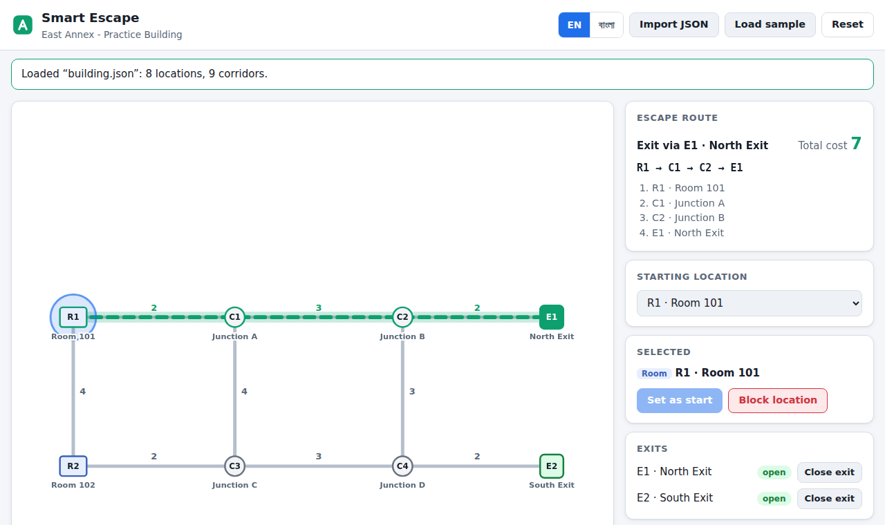
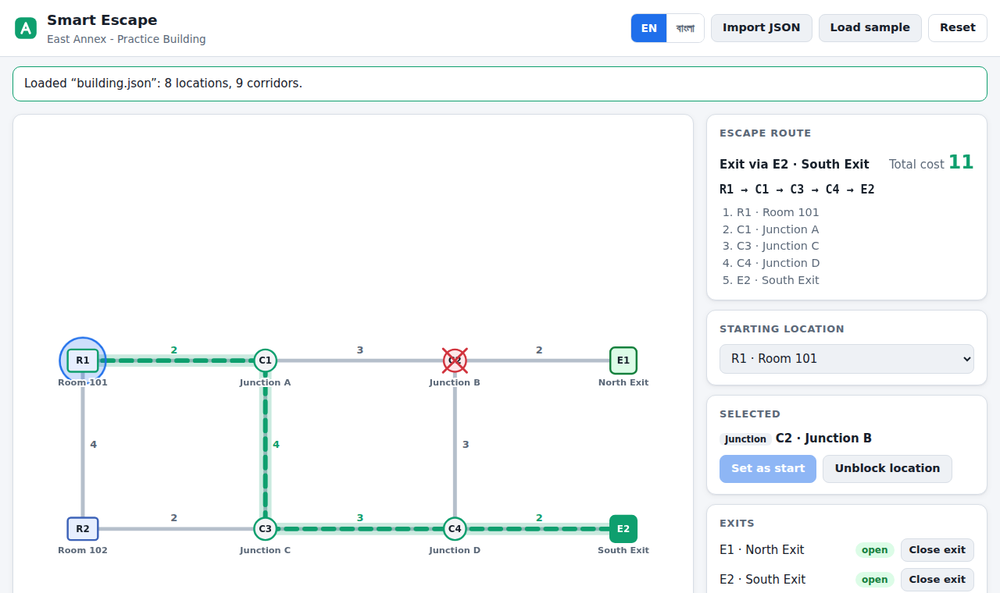

# Smart Escape: Interactive Evacuation Route Simulator

Built for the AI DevFest mock test.

| | |
|---|---|
| **Name** | Ariful Islam Arif |
| **Registration number** | 232-15-580 |
| **Live site** | **https://devfest-232-15-580.vercel.app** |
| **Repository** | https://github.com/ariful-arif-232/devfest-232-15-580 |

Smart Escape is a frontend-only web app. Import a building as JSON and the app draws it as an SVG map. It then finds the lowest-cost route from your chosen starting location to an open exit. It recalculates the route as soon as you block a location or corridor, or close an exit.

Smart Escape is an educational simulation, not a certified real-world evacuation planning tool.

## Screenshots

These use the official `building.json`.

| Baseline: select R1 | After blocking C2 |
|---|---|
|  |  |
| R1 → C1 → C2 → E1, cost 7 | R1 → C1 → C3 → C4 → E2, cost 11 |

## Running it

Open the **live site** above in the latest Chrome. No login or installation is needed.

To run it locally, serve the folder with any static file server:

```sh
python3 -m http.server 8080   # or: npm start
# then open http://localhost:8080
```

1. Click **Import JSON** to choose a building file, or drag one onto the map. **Load sample** loads the bundled official `building.json`.
2. Choose a starting room or junction from the **Starting location** list, or click it on the map and choose **Set as start**.
3. Click any location, corridor or exit to block, unblock, close or reopen it. The route updates immediately.
4. **Reset** restores the file's `initial_state`. Your chosen start is kept.
5. Use **EN / বাংলা** to switch language.

If you open `index.html` directly from disk, **Import JSON** still works. **Load sample** needs a server, because browsers block `fetch` on `file://` pages.

There's no backend, serverless function, database or external API. Everything is plain HTML, CSS and JavaScript with no build step and no dependencies.

### Tests

```sh
npm test   # node --test, no dependencies
```

The tests cover:

- all five official sample checks
- the exact tie-break order
- blocked corridors, closed exits and disconnected graphs
- every validation rule

## Implemented features (mandatory)

- **Import and validation.** The importer follows the official schema strictly. Any malformed or inconsistent file is rejected with a clear message for each problem, in English or Bangla. If an import fails, the previous building stays on screen. The importer works for any file with the same schema; nothing is hard-coded.
- **Map.** Every node is drawn at its supplied `x`/`y`, with readable labels. Rooms, junctions and exits each have their own shape, and every corridor shows its cost. The map scales to fit any coordinate range.
- **Select and calculate.** You can choose any unblocked room or junction as the start. The app highlights the lowest-cost route and lists its node sequence, exit and total cost.
- **Change conditions.** You can block or unblock rooms and junctions, block or unblock corridors, and close or reopen exits. Each state looks different on the map and is also listed in the side panel.
- **Update and reset.** The route is recalculated immediately after every start or hazard change, without reimporting. Reset restores the file's original `initial_state`.
- **Failure cases.** **No route available** and **Starting location blocked** appear on the map and in the route panel.
- **Two languages.** Every label, button, status, error and instruction is available in Bangla and English. Bangla mode also uses Bangla digits. Labels from the dataset stay as written in the file.
- **Subtle animations.** Short animations play when you select a location, toggle a hazard or change the route. The route line draws in and flows, and alerts slide in. Nothing flashes or delays the controls, and all animation is turned off when the system's reduced-motion setting is on.

## Routing rules

Routing uses deterministic Dijkstra on an undirected weighted graph (`src/graph.js`):

- A route's cost is the sum of its edge `cost` values. Coordinates and the number of corridors are never used.
- Blocked nodes are excluded, along with every corridor attached to them. Blocked corridors and closed exits are excluded too, including as intermediate nodes. A blocked corridor removes only that connection.
- The route goes to the reachable open exit with the **minimum cost**. If two exits cost the same, the **lexicographically smallest exit ID** wins. If two paths to that exit also tie, the **lexicographically smallest node-ID sequence** wins. IDs are compared case-sensitively in plain string order.

### Official sample checks

All five pass, both in the automated tests and in the live UI.

| Scenario | Action | Result |
|---|---|---|
| Baseline | Select R1 | R1 → C1 → C2 → E1; cost 7 |
| Blocked junction | Select R1; block C2 | R1 → C1 → C3 → C4 → E2; cost 11 |
| Exits closed | Select R1; close E1 and E2 | No route available |
| Different start | Select R2 | R2 → C3 → C4 → E2; cost 7 |
| Blocked start | Select R1; then block R1 | Starting location blocked |

## Input format

```json
{
  "building": "East Annex - Practice Building",
  "nodes": [{ "id": "R1", "label": "Room 101", "type": "room", "x": 60, "y": 65 }],
  "edges": [{ "id": "L01", "from": "R1", "to": "C1", "cost": 2 }],
  "initial_state": { "blocked_nodes": [], "blocked_edges": [], "closed_exits": [] }
}
```

The importer rejects a file, with a message for each problem, if any of these are true:

- `building` is not a non-empty string.
- A node doesn't have a unique, non-empty `id`, a non-empty `label`, a `type` of exactly `room`, `junction` or `exit`, or numeric `x` and `y`.
- An edge doesn't have a unique `id`, or its `from` or `to` isn't an existing node ID. IDs are case-sensitive.
- An edge's `cost` is not a positive integer.
- The file contains a self-loop, or more than one edge between the same pair of nodes.
- There are fewer than 2 or more than 60 nodes, or fewer than 1 or more than 150 edges.
- There isn't at least one room or junction and at least one exit.
- `initial_state` is missing, or any of its three arrays is missing.
- An `initial_state` ID doesn't exist or is in the wrong category. Blocked nodes must be rooms or junctions, blocked edges must be edge IDs, and closed exits must be exits.

Empty `initial_state` arrays and disconnected graphs are valid. Unknown extra fields are ignored.

## Bonus features

I didn't attempt the optional extensions: alternative routes, high-contrast mode, PNG export, saving progress and route walkthroughs. The app does have some small extras: keyboard access to the map, drag-and-drop import, a dark theme, and remembering the chosen language.

## Known issues

- **Load sample** only works when the folder is served over HTTP(S). **Import JSON** always works.
- Labels can overlap on datasets whose nodes are placed very close together, because the map always uses the supplied coordinates as given.

## AI tools and most useful prompt

- **AI tool used:** Claude Code, used for implementation, testing and deployment. Each commit message includes the prompt used for that change.
- **Most useful prompt:** *"Implement JSON import, validation, graph modelling and deterministic Dijkstra routing for Smart Escape."*

## Project layout

```
index.html          page markup
styles.css          layout, themes, map styling and animations
building.json       official sample building
src/validate.js     JSON import and strict validation
src/graph.js        graph model and deterministic Dijkstra
src/map.js          SVG map rendering
src/i18n.js         Bangla / English strings
src/app.js          state, controls and rerouting
tests/              Node test runner tests
screenshots/        baseline and rerouting screenshots
```

## License

MIT. See [LICENSE](LICENSE).
